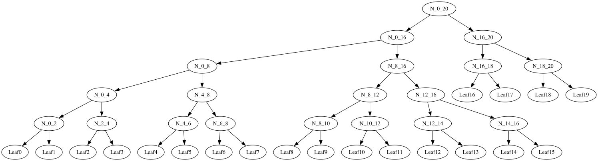
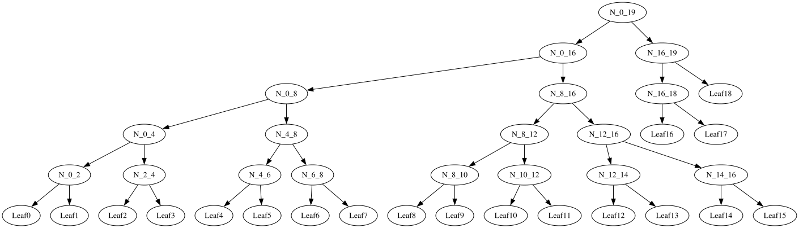
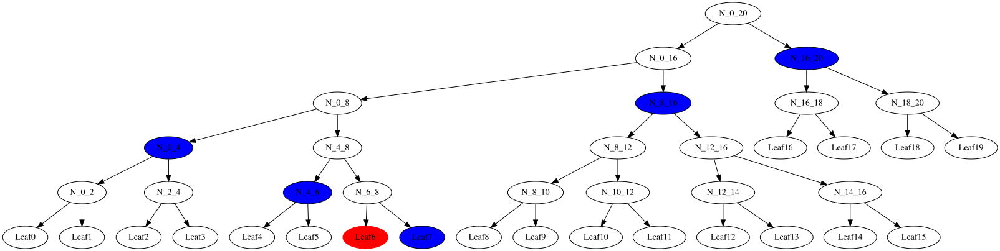

# Algorithm Analysis

To see if we can come up with more a compact representation and interpretation of a batch of inclusion proofs need to understand the algorithm and see the tree.

Items to note:

1. The tree structure is completely determined by the list size and not the values of the leaves or intermediate node hashes.
2. During tree creation the root value is computed recursively from the top down using the `subtreeHash()` function.
3. Inclusion proofs are computed recursively from the bottom (leaf) up using the `path()` function. The return value is a list of hashes.
4. Verification of proofs are **not** done recursively. It is done by starting with the given leaf hash then combining with the hashes in the inclusion proof. The tree size and the leaf index control the order (left, right) of how the node hashes are computed up the tree towards the root.
5. There is no need to verify leaves individually. For example full disclosure of all the leaves allows a check without sending any extra proof information, just recompute the hash corresponding to the tree root node.

## Example Tree of 20 Leaves

This is extracted from an VC example that has 20 non-mandatory statements.

* *n* is the length of the list to be turned into a tree
* For n > 1, let k be the largest power of two smaller than n (i.e., k < n <= 2k).
* `MTH(D_n) = HASH(0x01 || MTH(D[0:k]) || MTH(D[k:n]))`
* D[k1:k2] = D'_(k2-k1) denotes the list {d'[0] = d[k1], d'[1] = d[k1+1], ..., d'[k2-k1-1] = d[k2-1]} of length (k2 - k1)
  
Recursive thing:
1. n = 20, k = 16: MTH(D_n) = HASH(0x01 || MTH(D[0:16]) || MTH(D[16:20]))
2. n = 16, k = 8: MTH(D[0:16]) = HASH(0x01 || MTH(D[0:8]) || MTH(D[8:16]))
3. n = 20, k = 8: MTH(D[16:20]) = HASH(0x01 || MTH(D[8:20]) || MTH(D[])

Let try reconstructing the tree from the dump (use only minimal leading bytes of hash):

```
Root:
(0, 20):48ca
Level 1:
(0, 16):6171; (16, 20):148f
Level 2:
(0, 8): 7256; (8, 16):38ae; (16, 18):87e0; (18, 20):f908
Level 3 (note only 4 entries):
(0, 4):36f3; (4, 8):56c7; (8, 12):d4f4; (12, 16):33c0

```

Instrumented dump from recursive `subtreeHash()` function:

```text
(0, 2): ff93f710ce6e80bd503c117d00da9ba51a017558fcef897f2024e1a6232e3824 // level 4 and hash of leaves 0 & 1
(2, 4): 5451ee87ab7b15ea7651ae144e5a8cc10634c89d9a11201058d8d0ada11094d7 // level 4
(0, 4): 36f3d382e52dd85145945bdd2184a432c46c2d8341eb1560ff14dadbbb5124c6 // level 3
(4, 6): 25ef73f0ee00f5fd544d98d95a792e3854534a79b8db57c25763b332ba13de58 //  level 4
(6, 8): e07cf33015203694b44bc75f3e739a619a9b628379349aa0d90e8f887ac21faf //  level 4
(4, 8): 56c7c1a89a9fd9b35f649bddfbe2ceaec40257e8bd5bab7d9a2adcdeff45f5a1 // level 3
(0, 8): 72566fc8ce3f6c2108f3a8150a63cefe69c54e2ee052ff1786c918045f494115 // level 2
(8, 10): 17dfd8d4375f72cb7da401228a126c1c540d639942306c97dc26a28cca9096f1  // level 4
(10, 12): 3d69eb828b2d99364ba114a9cca65ca9473f4ab10c8059fc9ccded9447aaf7df  // level 4
(8, 12): d4f473d5c0572255cc992a709d42cd1861ffa65576347ca2cff56081f79d359c // level 3
(12, 14): ce9e72a50fb10e53de9c8033ee19d0820bf94c44506558f21beeec1a7eb40dcc // level 4
(14, 16): 35e566b9946de1785519684edee470becdb7e52c727991949a36f4b4b4c859db // level 4
(12, 16): 33c055dd0f2ca7a17368f8fa5ac0fc77f3821d30be137484d76df2f8b4bfc542 // level 3
(8, 16): 38ae25ee5967e3c066a36fc65d5ff9604bc2b69ddc36faf59f92449f3dfa87a7 // level 2
(0, 16): 61710673681b7304f578069bd59cf575e4bc885c4ec8cdf19f0a48b8fd630327 // level 1
(16, 18): 87e0e5b42d51dc7dfff3b29bc02010b52953715af9dbd220dad181d7741e26e4 // level 2 and hash of leaves 18 & 19
(18, 20): f9085c1d4d4e61248281494592552377d633a1d0f90b467ec07b8b2e3dd92aea // level 2 and hash of leaves 1
(16, 20): 148f1c54b071fd9fd6bb74148eccc097bb4aaca1ddeedd1ad8d5ddbce9cab6b3 // level 1
(0, 20): 48cadd72866b40b6353796152076163bce5432f3de16dad47bff80a03de18991 // root
```

In visual form with better instrumentation and help from GraphViz.

Merkle tree from algorithm for n = 20:



Merkle tree from algorithm for n = 19:



Inclusion Proof:

For leaf 6:
N_16_20
N_8_16
N_0_4
N_4_6
Leaf7


