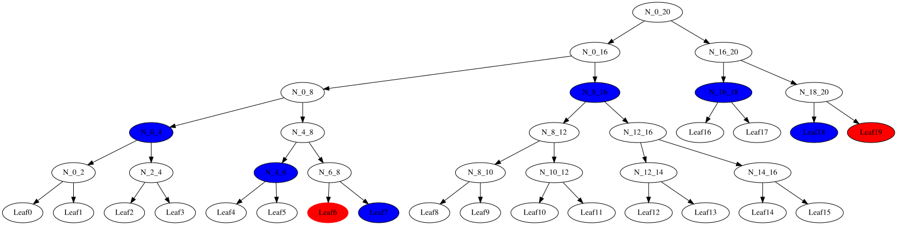
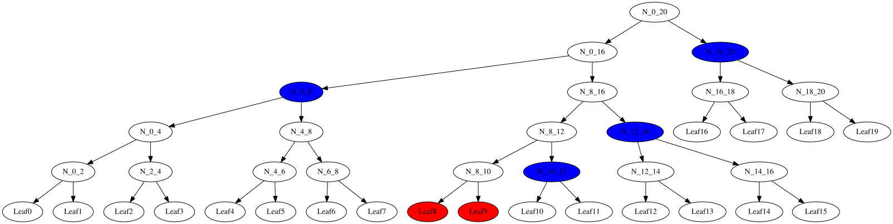
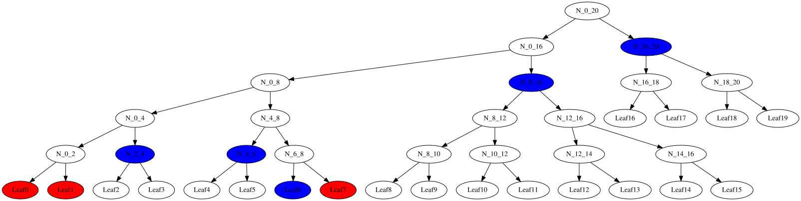

# Merkle Tree for Selective Disclosure

[RFC9162](https://www.rfc-editor.org/info/rfc9162/#section-2.1) Gives a basic algorithm to implement Merkle tree functionality. It includes:

1. Creation of a Merkle tree. This includes computation of all the leaf hashes and the "Merkle Tree Hash" (MTH). It doesn't save the intermediate node values.
2. Generating an inclusion proof to show that an item in the list is a leaf of the Merkle tree.
3. Verifying an inclusion proof.

## Application to Verifiable Credential Selective Disclosure

1. The list in our case is the canonicalized non-mandatory statements from the *issuer*. In detail the salt value concatenated with the non-mandatory statement value.
2. The *issuer* signs the MTH with a specified signature method.
3. The *holder* supplies an inclusion proof for each statement they choose to reveal.
4. The *verifier* verifies the signed MTH with the signature verification algorithm and then verifies each statement by concatenating the corresponding salt in front of the statement and using the verify inclusion algorithm.

**Example** The figure below shows the tree for a list of size 20 with an inclusion proof for leaf 6. The inclusion proof is a collection of additional node hash values need for recomputation of the root hash value. In the case of leaf 6  it is the nodes [N_16_20, N_8_16, N_0_4, N_4_6, Leaf7]. In the figure the node we are performing a proof for is shown in red, while the nodes needed in the proof are shown in blue.


**Problem**: Using a separate inclusion proof for each selectively disclosed statement is inefficient. In the worst case of "full disclosure" results in a combined proof size that can be multiple times the size of list that the Merkle tree was supposed to help prevent sending. Simple de-duplications are not sufficient.

**Solution** Send a proof sub-tree rather than separate paths per leaf to be proved. This is sometimes referred to as a "multi-proof".

**Example 1** Inclusion proof tree for leaves 6 and 19. Leaves to be proven are shown in red, proof sub-tree nodes are shown in blue.Below is an example of the additional nodes shown in blue to verify the given leaf hashes shown in red.



The two separate inclusion proofs for leaves 6 and 19 would have had lengths 5 and 4 respectively. While from the diagram we can see a total of 6 additional nodes of information a required rather than 9.

**Example 2** In the figure below we show a sub-tree proof for leaves 8 and 9. In this case instead of two proofs of length 5 we have a single "batch proof" of length 4.

Note all this structure we are seeing in the sub-tree proof is determined by the tree size and the indexes of the leaves to be proven and not the data in the tree.



**Example 3** For leaves [0, 1, 7] our algorithm produces a multi-proof (sub-tree proof) array ['N_2_4', 'N_4_6', 'Leaf6', 'N_8_16', 'N_16_20']. Notice how each blue (proof node) represents a range of un-selected leaves.



## Algorithms and API

### Merkle Tree Construction

[RFC9162](https://www.rfc-editor.org/info/rfc9162/#section-2.1) provides a procedure to recursively generate a (binary) Merkle tree for an arbitrary length list. They do not keep the full tree as part of their computation, we do and name our nodes based on the recursive calls to the tree computation algorithm.

For example you can see our node naming conventions in the Merkle tree below for a list of size 19.


### Sub-Tree Proof (Multi-Proof)

From Devin @studyzy on GitHub:

```
If the batch is aggregated into a single minimal proof instead (known in the literature as a Merkle multi-proof or batch proof), the redundancy goes away.

The aggregation rule is a small recursion over the set of disclosed leaf indices:

1. All leaves under this node are disclosed → emit nothing (the verifier rebuilds this node from the disclosed leaves).
2. No leaf under this node is disclosed → emit this node's hash (1 value).
3. Mixed → recurse into both children and union the results.

The derived proof carries the union of emitted hashes plus the disclosed statements; the verifier reconstructs the root with the same MTH procedure as RFC 9162, skipping subtrees it can rebuild.
```

### Sub-Tree Proof Verification

A straightforward approach would be:

1. Recreate an empty tree based on the `treeSize` (length of the list to be incorporated into the Merkle tree.).
2. Based on the `leafIndexes` (indexes of the leaves to be proven) create the multi-proof array like above that contains "symbolic" names for the tree nodes.
3. Add in values for the leaf nodes to be proven.
4. Assign values to the tree nodes based on the values in the given multi-proof and the symbolic multi-proof and the given indexes.
5. Compute the root has from the populated binary tree and check it.

### API

See [merkleMultiProof.js](./merkleMultiProof.js).

* Tree creation: `let tree = new MerkleTree(entries)` where *entries* is an array of UInt8Arrays.
* The Merkle Tree Hash (MTH) is in  `tree.mth`.
* Subtree proof: `tree.inclusionMultiProofValues(leafIndexes)` where *leafIndexes* is an array of the leaves to be proven. The result is an array of node/leaf hash values.
* Subtree proof verification: `calcRoot = verifyMultiProof(treeSize, selected, selectedLeaves, subtreeProofValues)` where *treeSize* is the size of the original list, *selected* is an array of indexes of the leaves to be verified, *selectedLeaves* is an array of the leaf hash values to be verified, and *subtreeProofValues* is an array of the proof values.
